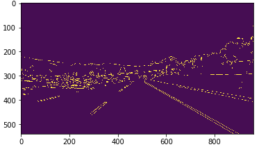

# **Finding Lane Lines on the Road** 

Overview
---

When we drive, we use our eyes to decide where to go.  The lines on the road that show us where the lanes are act as our constant reference for where to steer the vehicle.  Naturally, one of the first things we would like to do in developing a self-driving car is to automatically detect lane lines using an algorithm.

---

### Reflection

### 1. Describe your pipeline. As part of the description, explain how you modified the draw_lines() function.

My pipeline consisted of 5 steps:
1. converted the images to greyscale
2. applied a Gaussain Blur with kernel size of 5 to smooth out sharpe edges
3. used the Canny edge detection algorithm to find all the edges. 
4. applied the Hough Line transformation to a pre-defined polygon that focuses on the bottom part of the image.
5. extrapolated the detected lines and averaged segments to draw a full line

In order to draw a single line on the left and right lanes, I modified the draw_lines() function by finding line segments that have close slope(+/- 0.01 tolerance) and group them as candidates for `left_lane` and `right_lane`. To obtain an approximate threshold for the slope, I ran the test images to narrow down the range. For `right_lane`, the slope range is 0.5 to 10. For `left_lane`, the range is -0.5 to -0.8. I kept a big range in order to accommodate different situations.

- Grey and smoothed

  

- Canny edge detection

  

- Edge in region of interest

  

- Line extrapolation

  

- Final result

  

- For video processing, I added KCF tracking between frames when a detection failed. The green line in the image is a tracking result while all red lines are detections. 

  

### 2. Identify potential shortcomings with your current pipeline

- Parameter tuning. The threshold for lane candidates uses an average result from limited set of testing images. And the parameters for Canny edge detection, Hough Line transformation are also hard-coded. This value setup might work on some occasions, but not necessarily all. 

- Single source of detection. We rely solely on Hough Line detection. This doesn't work well for curved lane and also heavily dependents on the edges from Canny. Canny method is gradient dependent, so if the lighting condition changes in the `challenge` video, this method also works way less robust. 

### 3. Suggest possible improvements to your pipeline

- A possible improvement would be to add another layer of verification: a color based detection to enhance the results. Since Hough Transformation wasn't very error-prone on dash lanes.

